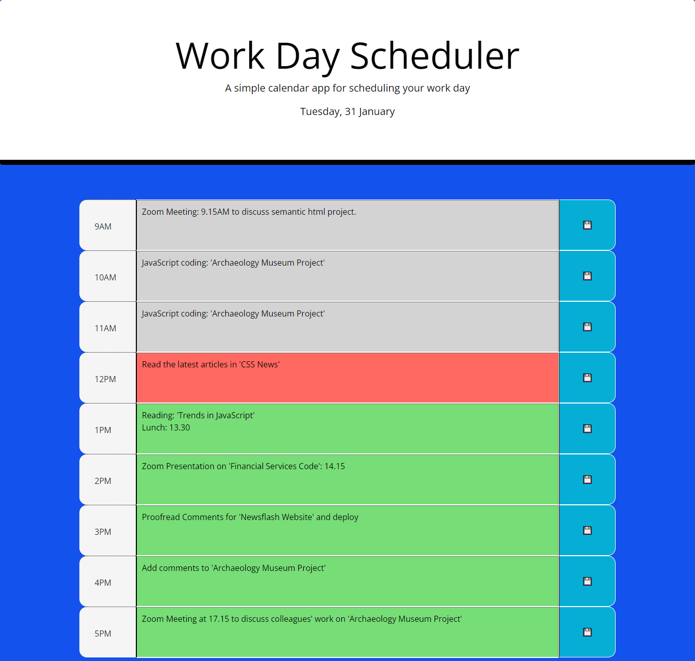

# Work Day Scheduler

## Description
The purpose of this project was to create a useful day scheduler where upcoming events can be stored in nine text areas corresponding to the hours of the typical working day (from 9AM to 5PM). A key feature of the scheduler is the use of moment.js to provide the present date and day of the week in the jumbotron section. It is also used as the basis for color-coding the cells of the day scheduler to indicate which hours represent the past (grey), the present (red) and the future (green). A 'for' loop is used to set the colors of the different hours of the scheduler using a variable derived from moment.js to present a number for the hour of the day on a 24-hour clock. An array with numbers representing the different hours for each of the nine 'textarea' cells (whole numbers: 9-17) is compared with the value for the present hour. A color is selected for each 'textarea' based upon whether its value is equal (present), greater (future) or smaller (past) than the number derived from moment.js. The jQuery css() method is then used to format the 'background-color' of the text area accordingly. Appointment information can be saved from the 'textarea' elements using the 'localStorage' property and retrieved from an array using a 'for' loop whenever the page is refreshed or reloaded. Nine event listeners in columns to the right of each 'textarea' allow the user to save appointments to 'localStorage' with a mouse 'click'. A 2-second alert is given to verify to the user that the information has been saved. A CSS 'transition' property, activated upon 'hover' over the save buttons, magnifies a floppy disk/save emoji to emphasise to the user the function of the save buttons; in addition, the 'cursor' property changes the mouse cursor to 'pointer' over these buttons. 

## Installation
N/A

## Usage
Text may be entered into any of the colored areas within the central column. The colors represent: the past (grey), the present (red) and the future (green). Clicking a blue button in the right-hand column will save any information typed into the 'textarea', to its left, to 'localStorage'. This information can be retrieved upon refresh or reloading of the page.

## Credits
N/A

## License
N/A

## https://davidbluelamassu.github.io/Work-Day-Scheduler/

